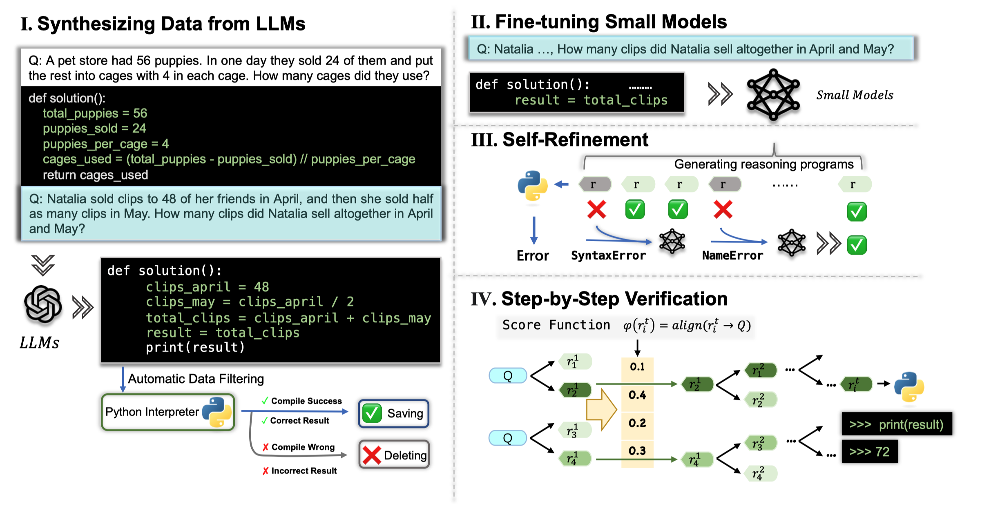

# PaD

This repo inculdes the code in the paper [PaD: Program-aided Distillation Can Teach Small Models Reasoning Better
than Chain-of-thought Fine-tuning](https://github.com/Xuekai-Zhu/pad/blob/master/paper/PaD%3A%20Program-aided%20Distillation%20Can%20Teach%20Small%20Models%20Reasoning%20Better%20than%20Chain-of-thought%20Fine-tuning.pdf) (NAACL 2024 Long Paper).



## Prerequisites

- `torch` >= 2.0
- `transformers`
- download pre-trained models (CodeT5_small/base/large on [Hugging Face](https://huggingface.co/Salesforce))

## Data 

```markdown
├── Data
   └── GSM8K   
       └── train-enhanced.json # pad-augmented gsm8k training data by gpt-3.5-turbo
       └── test_add_code.json # test data with pad-augmented label code
   └── MultiArith  # test data with pad-augmented label code
   └── SVAMP # test data with pad-augmented label code
   └── ASDiv # test data with pad-augmented label code
```

## Quick Start

### 1. Training 

Execute the following command to re-produce our models: 

```shell

sh run_seq2seq.sh

```


### 2. Eval 

run the following scripts to generate your results: 

```shell
sh run_seq2seq_test.sh
```
